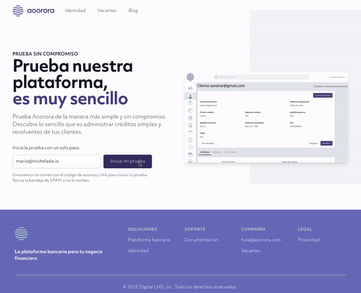
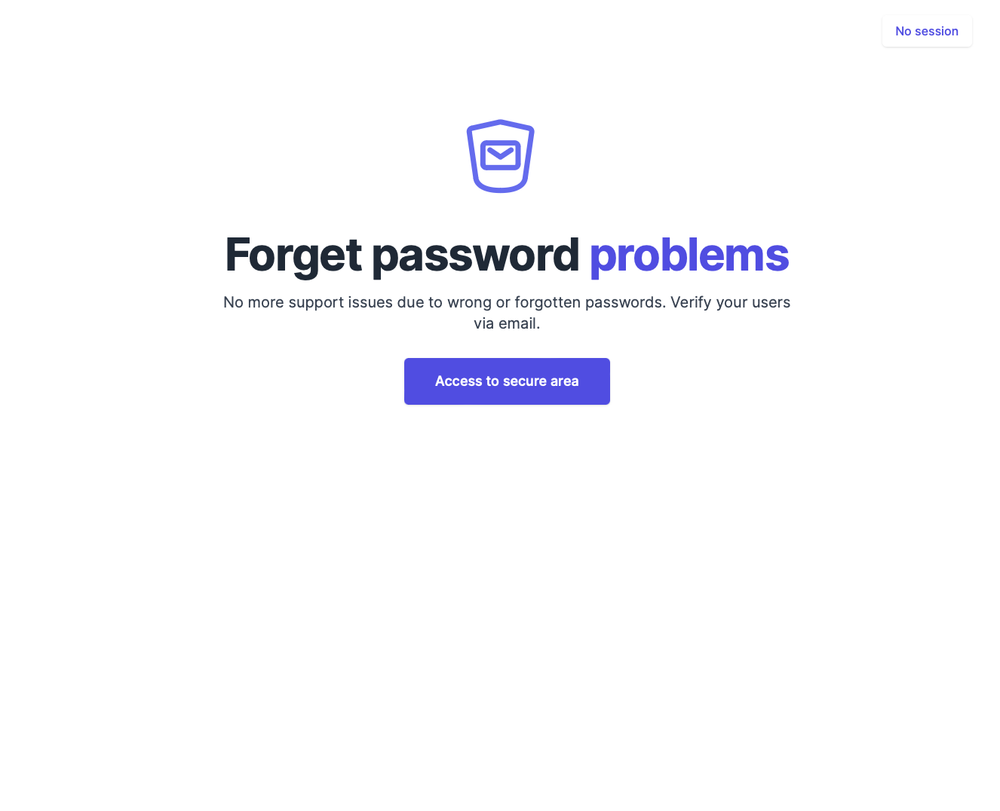

# NoPassword

NoPassword is a Ruby on Rails gem that allows session authentication with a token or a magic link via an email sent to the user; there is no need for a password.

## Table of contents

- [Requirements](#requirements)
- [Installation](#instalation)
- [Configuration](#configuration)
    - [Initializer](#initializer)
    - [Locales](#locales)
    - [Email configuration](#email-configuration)
    - [Custom views](#custom-views)
- [Usage](#usage)
  - [Action filter](#action-filter)
  - [Helper methods](#helper-methods)
  - [Callback](#callback)
- [Generators](#generator)
- [Develooment and tests](#development-and-tests)
- [License](#license)

## Requirements

NoPassword is a Rails Engine that needs Ruby on Rails 7.0 or better and Ruby 3.0.2 o better.
NoPassword flow is composed of two views for the user to enter an email, and the received token. The engine uses TailwindCSS via [tailwindcss-rails](https://github.com/rails/tailwindcss-rails) and StimulusJS served with the browser's Importmaps.

Customization for CSS and Javascript is possible; refer to [Views personalization](#views-personalization) to learn how to extract gem templates.

## Installation

Add NoPassword gem reference to your application's `Gemfile`.
```ruby
gem "no_password_auth", require: "no_password"
```
Or add gem reference from its Github repository.
```ruby
gem "no_password_auth", git: "https://github.com/creditario/nopassword.git", require: "no_password"
```

In any case, execute `bundle` to install the gem.
Next, use the gem installer to install migrations and the gem initializer.

```bash
$ bin/rails no_password:install
```
Don't forget to execute database migration after this step.
```bash
$ bin/rails db:migrate
```

The following section explains configuration options for the NoPassword gem with its initializer file.

## Configuration
After installing the NoPassword gem, the engine is mounted at the `/p` path inside the `config/routes.rb` file.

### Initializer
After installing the NoPassword gem, the engine is mounted at the `/p` path inside the `config/routes.rb` file.

NoPassword initializer is located at `config/initializers/no_password.rb`. The gem provides three configuration options. Session expiration by default is set to two hours after a new session is started. To adjust this time, use `session_expiration` attribute to set a new value.
Token expiration is set by default to 15 minutes. Update `token_expiration` increase or decrease this time.

`secret_key` is the key used to sign magic links URLs; if this value is `nil`, then Ruby on Rails  `secret_key` is used for this cryptographic task.

```ruby
NoPassword.configure do |config|
  # Session expiration time
  # config.session_expiration = 2.hours
  #
  # Token expiration time
  # config.token_expiration = 15.minutes
  #
  # Secret key to cypher tokens, if none, then Rails secret key is used
  # config.secret_key = nil
end
```

### Locales
NoPassword gem includes locales for Spanish and English languages. Set your language configuration at the main application `config/application.rb`.

```ruby
config.i18n.default_locale = :es
config.i18n.available_locales = [:en, :es]
```

### Email configuration
NoPassword uses ActionMailer to email the user its token and magic link. If a background strategy is setup for ActiveJob, like [Sidekiq](https://sidekiq.org) then emails are sent in the background.

Remember to configure `default_url_options` and `asset_host` inside `config/enviroments/production.rb` file.

```ruby
config.action_mailer.default_url_options = { host: "my-domain.com" }
config.action_mailer.asset_host = "https://my-domain.com"
```

In development mode, having a tool like [letter opener](https://github.com/ryanb/letter_opener) helps to open emails inline, preventing sending emails. Add letter opener gem reference to your `Gemfile` and run `bundle` to install it.

```ruby
gem "letter_opener", group: :development
```

Configure the letter opener by opening `config/enviroments/development.rb` and adding the following configuration.

```ruby
  config.action_mailer.delivery_method = :letter_opener
  config.action_mailer.perform_deliveries = true
```

### Custom views
This step is necessary only if you plan to customize the views provided by NoPassword. The following generator copies all engine views into `views/no_password` and `views/layouts/no_password`.

```bash
$ rails no_password:install:copy_templates
```

## Usage
After installing NoPassword, you can use the filters and **helpers** provided by the gem to query if there is an active session or to send the user to the sign in process.

### Action filter
The filter `authenticate_session!` is defined when the module `NoPassword::ControllerHelpers` is included in a controller. This filter is used with a `before_action` to secure a controller or controller action. When a user reaches a controller protected by this filter, and there is no active session, the user is redirected to the sign-in process.

```ruby
  include NoPassword::ControllerHelpers
  before_action :authenticate_session!
```

### Helper methods
The module `NoPassword::ControllerHelpers` includes methods `signed_in_session?` and `current_session` to query if there is an active session or to get more information about an active session. These methods are also exposed as helpers in the Rails view context.

```erb
<% if signed_in_session? %>
  <%= current_session.email %>
  <%= button_to "Sign out", no_password.session_path(current_session.id), method: :delete %>
<% else %>
  <%= link_to "Sign in", no_password.new_session_path %>
<% end %>
```

### Callback
NoPassword sign in flow has two pages; the first one receives the user email, creates a token and a magic link, and then sends it via email. The second page accepts the token and decides whether the user can have a session.
However, an application may require a different flow, which is why the callback `after_sign_in!` exists.

This is an example of a custom flow that mimics a Single Page flow.



The callback is called on every intent to start a session, whether the sign was successful or not.
```ruby
after_sign_in!(signed_in, by_url, return_url)
```
It receives three parameters.
- `signed_in`: A boolean value that indicates if the user succeeded in getting a session.
- `by_url`: A boolean value that indicates if the login happens with the magic link or entered token manually.
- `return_url`: A string value with the return path if the user succeeded in getting a session.

The `SessionConfirmationsController` controller expects any of the following possible values from the callback.
- `nil`: indicates callback was executed but is returning flow control to the controller.
- `render` o `redirect_to`: indicates callback was executed and is taking over sign in flow.

`after_sign_in!` callback is implemented by creating a `app/controllers/no_password/session_confirmations_controller.rb`  file in your application. The original controller from NoPassword engine is loaded, and then the callback is added with a `class_eval`.

```ruby
load NoPassword::Engine.root.join("app", "controllers", "no_password", "session_confirmations_controller.rb")

NoPassword::SessionConfirmationsController.class_eval do
  def after_sign_in!(signed_in, by_url)
    return do_something_different if signed_in # Do something different if user signed in successfully
    return nil if !by_url # Return control if failed to sign in with magic link

    flash[:alert] = "Your code is not valid"
    redirect_to main_app.demo_path # Redirect somewhere else if token is invalid
  end
end
```

## Generators
NoPassword gem has four Ruby on Rails generators. The first one is the installer which performs the following actions.

- Creates the gem initializer.
- Mount the engine in the routes file.
- Adds the gem Helpers into `ApplicationController`.
- Copy NoPassword migrations to the application.
- Generates the Tailwind config file and generates de CSS for NoPassword.

```bash
$ rails no_password:install
```
`copy_templates` generator copies gem templates to the application to allow views customization. Files are copied to `app/views` inside a `no_password` folder.

```bash
$ rails no_password:install:copy_templates
```

`migrations` generator copies the gem migrations to the application.

```bash
$ rails no_password:install:migrations
```

`tailwindcss::build` and `tailwindcss:watch` generators work together to generate de Tailwind CSS for gem views. Both generate a `tailwind.config.js` file that needs to be added to `.gitignore` file.
```bash
$ rails no_password:tailwindcss:build
```
`tailwindcss::build` generator connects automatically to the assets compilation process in production to generate the Tailwind CSS for the gem.

```bash
$ rails no_password:tailwindcss:watch
```
`tailwindcss:watch` generator is used in development to generate the Tailwind CSS for the gem. Add it to `Procfile.dev` file to ensure that CSS is generated in development when using Foreman or Overmind.

```ruby
no_password_css: bin/rails app:no_password:tailwindcss:watch
```

## Development and tests
A development environment for this gem is easy to create, clone the repository and run the script `bin/setup` to install dependencies and prepare a database (Postgresql). The script assumes that you have [Overmind](https://github.com/DarthSim/overmind) installed, which used the `Procfile.dev` to start the sample application on port 3090.

```bash
$ bin/setup
```



To execute the gem tests, use the script `bin/ci`, which also runs the linters.

```bash
$ bin/ci
```

## License
The gem is available as open source under the terms of the [MIT License](https://opensource.org/licenses/MIT).
